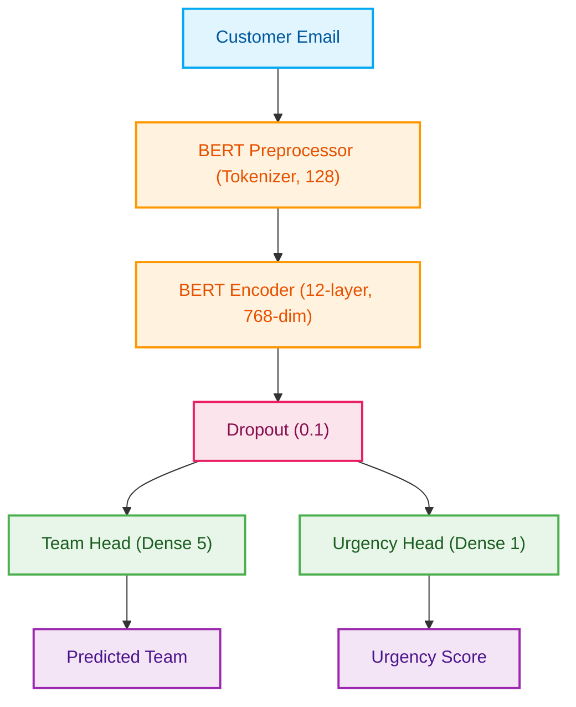
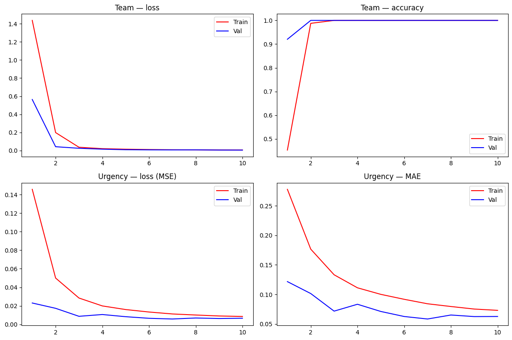
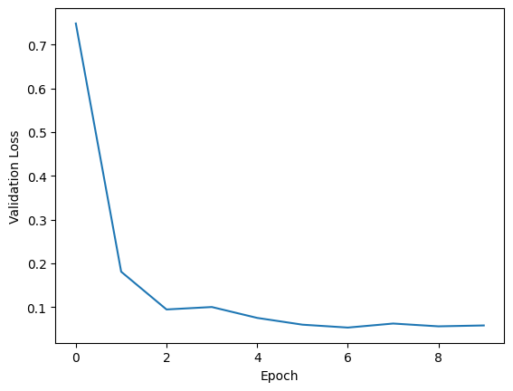

<p align="center">
  
  
  
  
</p>

<h1 align="center">📩 Customer Support Ticket Dispatcher</h1>

<p align="center">
  <b>Intelligently route customer emails to the right team — instantly.</b>
</p>

<p align="center">
  <i>An ML-powered system that classifies support tickets to the appropriate team<br/>
  and predicts urgency scores using a fine-tuned BERT model.</i>
</p>

---

## 🧠 What It Does

Handling customer support at scale is hard. This project uses **deep learning** to automate two critical decisions:

| Task | Description | Model Output |
|------|-------------|--------------|
| 🏷️ **Team Routing** | Classifies emails to the correct support team | One of 5 teams: `Billing`, `Engineering`, `CS`, `Sales`, `Security` |
| 🔥 **Urgency Scoring** | Predicts how urgent a ticket is | Continuous score from `0.0` (low) to `1.0` (critical) |

Both tasks are solved **simultaneously** using a single forward pass through a multi-task BERT model.

---

## 🏗️ Architecture



---

## 📊 Model Performance

Trained on the [Synthetic Support Emails](https://www.kaggle.com/datasets/pernavjain/synthetic-emails) dataset using a **Tesla P100 GPU**.

### Training Graphs

<p align="center">
  
</p>
<p align="center">
  
</p>

### Final Metrics

| Metric | Train | Validation | Test |
|--------|-------|------------|------|
| **Team Accuracy** | 100% | 100% | 100% |
| **Team Loss** (CrossEntropy) | 0.009 | 0.007 | 0.007 |
| **Urgency MSE** | 0.011 | 0.006 | 0.006 |
| **Urgency MAE** | 0.084 | 0.058 | 0.059 |

| Training Detail | Value |
|-----------------|-------|
| Base Model | `bert_en_uncased_L-12_H-768_A-12/3` |
| Optimizer | AdamW (lr=2e-5, 10% warmup) |
| Epochs | 20 (early-stopped at 10, best at 7) |
| Batch Size | 32 |
| Data Split | 70% / 15% / 15% |

> ⚠️ **Note**: The 100% accuracy is due to the synthetic nature of the training data. Real-world performance should be validated before production deployment.

---

## 🚀 Getting Started

### Prerequisites

- Python 3.11+
- pip

### Installation

```bash
# Clone the repository
git clone https://github.com/your-username/Customer-Support-Ticket-Dispatcher-ML.git
cd Customer-Support-Ticket-Dispatcher-ML

# Create a virtual environment
python -m venv .venv

# Activate it
# On Windows:
.venv\Scripts\activate
# On macOS/Linux:
source .venv/bin/activate

# Install dependencies
pip install -r requirements.txt
```

### Run the Streamlit App

```bash
streamlit run streamlit_app.py
```

Then open [http://localhost:8501](http://localhost:8501) in your browser.

### Run the FastAPI Server

```bash
uvicorn app:app --reload --host 0.0.0.0 --port 8000
```

API docs will be available at [http://localhost:8000/docs](http://localhost:8000/docs).

---

## 📡 API Reference

### `GET /`

Returns a welcome message.

```json
{
  "message": "Customer Support Ticket Dispatcher"
}
```

### `GET /health`

Health check endpoint.

```json
{
  "status": "OK",
  "version": "1.0.0",
  "model_loaded": true,
  "model_error": null
}
```

### `POST /predict`

Classify an email and predict urgency.

**Request Body:**
```json
{
  "email": "Hi, I was charged twice for my subscription last month. Can you please look into this and issue a refund? Thanks."
}
```

**Response:**
```json
{
  "predicted_team": "billing",
  "confidence": 0.987,
  "urgency_score": 0.723
}
```

---

## 📁 Project Structure

```
Customer-Support-Ticket-Dispatcher-ML/
├── assets/                         # Documentation images and graphs
├── app.py                          # FastAPI REST API server
├── streamlit_app.py                # Streamlit web interface
├── requirements.txt                # Python dependencies
├── runtime.txt                     # Python version specification
├── model/
│   ├── __init__.py                 # Package initializer
│   ├── prediction.py               # Model loading & inference logic
│   └── classifier.ipynb            # Training notebook (BERT fine-tuning)
├── schema/
│   ├── __init__.py                 # Package initializer
│   ├── prediction_request.py       # Request body schema
│   └── prediction_response.py      # Response body schema
├── .devcontainer/
│   └── devcontainer.json           # GitHub Codespaces / VS Code config
└── .gitignore
```

---

## 🛠️ Tech Stack

| Layer | Technology |
|-------|-----------|
| **ML Model** | TensorFlow 2.20 + BERT (via TF Hub) |
| **Training** | Jupyter Notebook, AdamW Optimizer |
| **API** | FastAPI + Uvicorn |
| **Web UI** | Streamlit |
| **Model Hosting** | Kaggle Hub |
| **Data** | Kaggle Datasets |
| **Language** | Python 3.11 |

---

## ✨ Features

- 🔮 **Multi-task Learning** — Single model predicts both team and urgency
- ⚡ **Fast Inference** — One forward pass for both outputs
- 🎨 **Beautiful UI** — Streamlit interface with color-coded urgency levels
- 📡 **REST API** — Production-ready FastAPI server with auto-generated docs
- 🏥 **Health Checks** — Built-in `/health` endpoint for monitoring
- 📦 **Lazy Loading** — Model downloaded and cached on first use
- 🐳 **Dev Container** — One-click setup via GitHub Codespaces

---

## 👥 Team

<table>
  <tr>
    <td align="center">
      <b>Harshit</b><br/>
      <sub>Developer & Engineer</sub>
    </td>
    <td align="center">
      <b>Pernav</b><br/>
      <sub>Project Lead & ML Architect</sub>
    </td>
  </tr>
</table>

---

## 📄 License

This project is for educational and research purposes.

---

<p align="center">
  Built with ❤️ using BERT, TensorFlow, FastAPI & Streamlit
</p>
